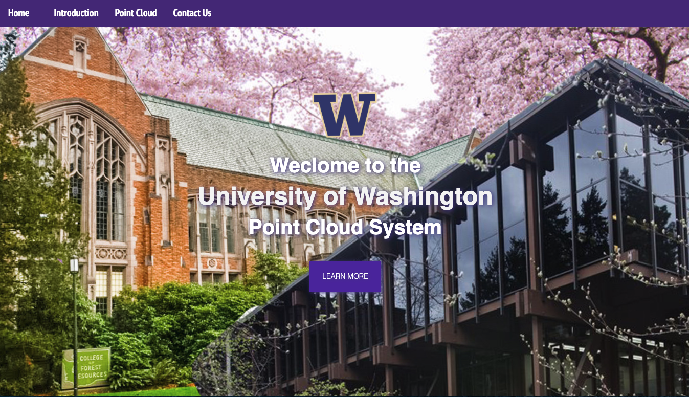
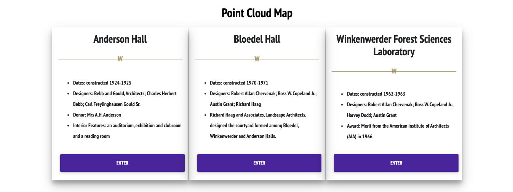
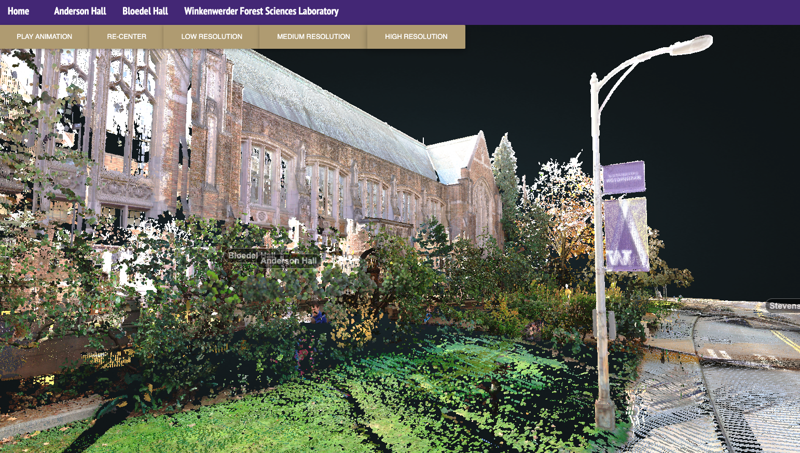

<h1><b>University of Washington
Point Cloud Virtual Tour</b></h1>

<h2><b>Before Cloning the Repository</b></h2>
<del>We upload the point cloud data via `git-lfs` service. Please install `git-lfs` (https://git-lfs.github.com) first before you clone the repository. Otherwise, the point cloud data will not be downloaded and you will not able to see the point cloud. Please note that the data is about 4GB.</del>
We stopped using git-lfs service. To correctly view the point cloud data, please download the data pack from https://drive.google.com/file/d/1vlizjHpdsFoJ0GUeYk1hCmd6r0xBUlKp/view?usp=sharing. After downloading, unzip the "UW_Campus" folder to the "pointclouds" folder.

<h2><b>Introduction</b></h2>

This project provides people with a new travel experience in the form of point cloud visualization. It mainly shows the buildings of the School of Environmental and Forest Sciences. The three parts of the campus of the University of Washington Forestry Department are Anderson Hall (1925), Winkenwerder Hall and Bloedel Hall. The three buildings are located on the southeastern edge of the campus and form a quiet wooded ensemble, surrounding a calm central courtyard. In the project, the point-cloud view can be adjusted to various angles to achieve the most immersive experience.

<h2><b>Project Goal</b></h2>

- To explore new possibilities with point cloud visualization and Potree
- Designing a new way for virtual tour

<h2><b>Function</b></h2>

The main page briefly introduce these three buildings. It helps people to have a big picture about the tour before they get into the point cloud virtualization page.

After clicking the "Enter" button, the second page shows like this:

On the left-up corner, there are three options to choose to adjust different levels of resolution. "Play animation" could play a camera animation along the preset route. "Re-Center" can reset the view angle.

<h2><b>Data Sources</b></h2>

<h3>Point Cloud Data</h3>

- The Lidar data is collected by Jonathan Batchelor from [the Remote Sensing & Geospatial Analysis Laboratory](https://sites.uw.edu/rsgal) at the University of Washington

<h3>Content</h3>

* [Pacific Coast Architecture Database](http://pcad.lib.washington.edu/)
* [UW Anderson Hall HRA](https://facilities.uw.edu/files/media/uw-anderson-hall-hra-final-02-27-2014.pdf)
* [Google Map](https://www.google.com/maps/place/Stevens+Way+%26+Garfield+Ln/@47.6518611,-122.3086412,18.11z/data=!4m13!1m7!3m6!1s0x549014ecfdbe11b5:0x1028765a0ee6429c!2sAnderson+Hall+(And),+Seattle,+WA+98195!3b1!8m2!3d47.6517622!4d-122.3075403!3m4!1s0x549014ed0635facf:0x850bf63da4453b74!8m2!3d47.6521071!4d-122.308655)

<h3>Music</h3>

* [Birds' Sounds](https://www.tukuppt.com/)

<h2><b>Libraries</bb></h2>

- [Potree](https://github.com/potree/potree/)

- [three.js](http://threejs.org/)

- [Jquery](https://jquery.com/)

- [laszip](http://www.laszip.org/)

- [Plas.io (laslaz) ](https://github.com/verma/plasio)

- [OpenLayers3](http://openlayers.org/)

- [proj4js](http://proj4js.org/)

- [tween](https://github.com/tweenjs/tween.js/)

- [i18next](https://github.com/i18next/i18next/)

- [mdb](https://mdbootstrap.com/)

- [bootstrap](https://getbootstrap.com/)

- [font-awesome](https://fontawesome.com/v4.7.0/icons/)

  
<h2><b>Acknowledgement</b></h2>

* Team members: Steven Bao, Brian Ho, Lola Kang
* Dr. Bo Zhao for ideation
* Jonathan Batchelor for the LiDAR data
* Help from [HGIS Lab at the University of Washington - Seattle](https://hgis.uw.edu/)
